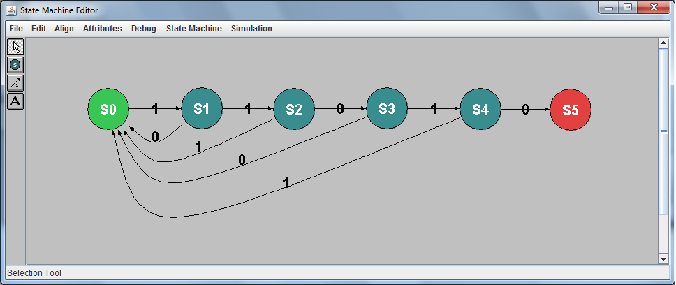
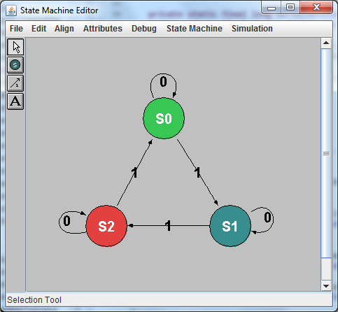

# FSM Editor & Simulator

This repository contains a tool for creating graphical representations of Finite State Machines and simulating their transitions for correctness.

The tool is built using Java and Swing.

